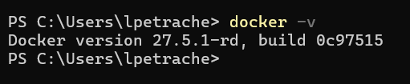
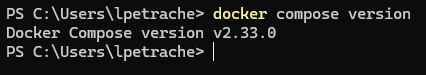

# Lucruri de pregatit inainte de primul laborator

## Windows
- [Virtualization activ](https://support.microsoft.com/en-us/windows/enable-virtualization-on-windows-c5578302-6e43-4b4b-a449-8ced115f58e1)
- [Rancher instalat](https://github.com/rancher-sandbox/rancher-desktop/releases)
- [Intellij](https://www.jetbrains.com/idea/download)
- [DBeaver](https://dbeaver.io/download/)
- [Postman](https://www.postman.com/)

Pentru a verifica daca docker si docker compose sunt instalate, deschideti un powershell si executati comenzile:
- `docker -v`. Ar trebui sa vedeti versiunea si build-ul instalat:

- `docker compose version`. Ar trebui sa vedeti versiunea instalata:

JDK-ul il vom instala folosind intellij, deci nu e nevoie sa il instalati separat.

## GNU/Linux:
- [Docker engine](https://docs.docker.com/engine/install/)
- [Docker compose](https://docs.docker.com/compose/install/linux/)
- [Intellij](https://www.jetbrains.com/idea/download)
- [DBeaver](https://dbeaver.io/download/)
- [Postman](https://www.postman.com/)

Ca sa verificati daca docker si docker compose sunt instalate, urmati aceiasi pasi ca si pentru Windows, dar folositi terminalul in loc de powershell.

Pentru eventualele probleme intalnite, putem sa le discutam la laborator.